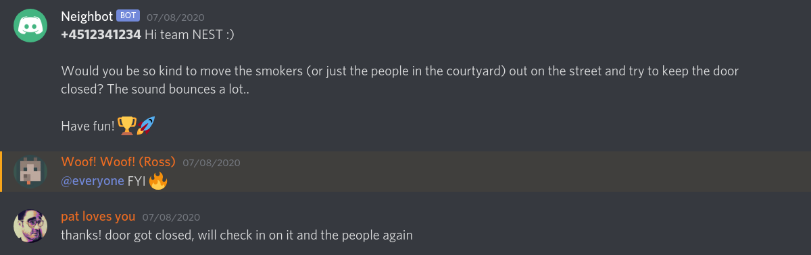

# Neighbot

Bridge between sms and discord, so neighbors can send stuff like noise complaints to a phone number, and the messages ends up in a discord channel.

## configuration

1. Set the environment variable `DISCORD_TOKEN` to a bot token retrived from your dicord developer account at https://discord.com/developers/applications
2. Make sure to invite your bot to a server with a text-channel named `neighbot`
3. Setup a twilio account and register a webhook for text messages pointing to wherever you decide to run neighbot

## running the code
`make docker-run`

## asyncio mess

As you can see in the code it is a little messy with coroutines and threads, but this is neccessary as the discord.py library is build around one blocking asyncronous call.

